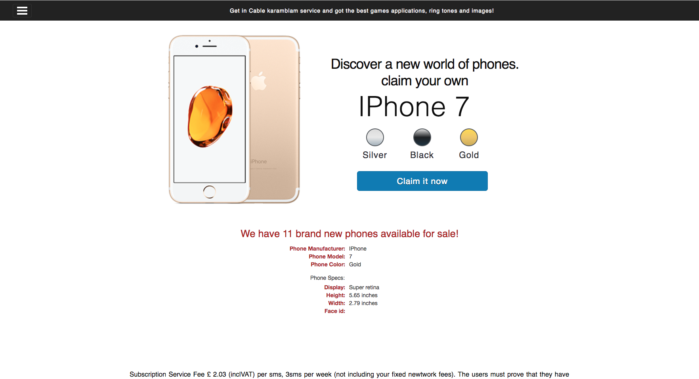
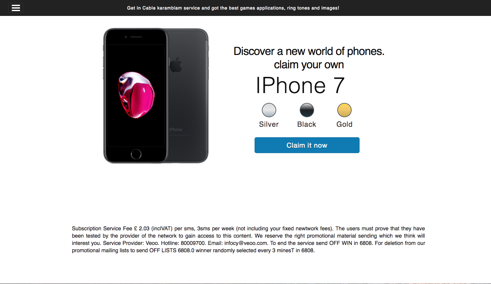
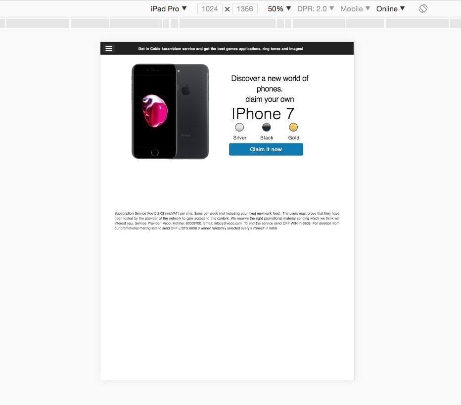
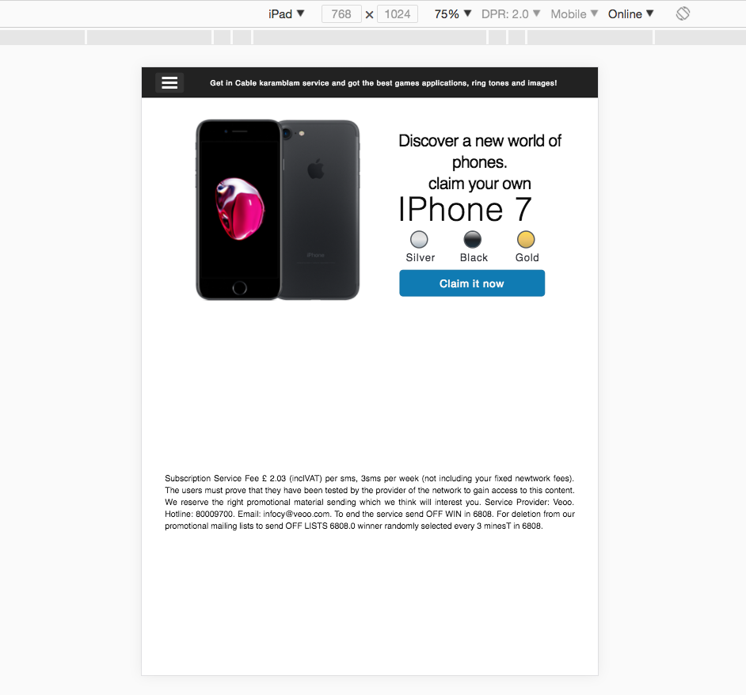
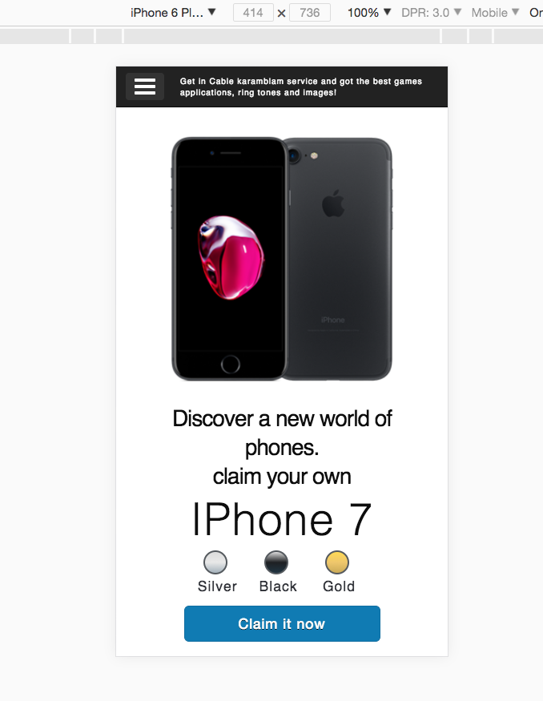

# how to

<kbd>phone latest</kbd>

<kbd>landing-page</kbd>

<kbd>iPad Pro</kbd>

<kbd>iPad</kbd>

<kbd>iPhone6 Plus</kbd>

- ***first***: clone repository, type:

- ***second***: install dependencies (npm install)

- third: run server `npm start` in terminal

