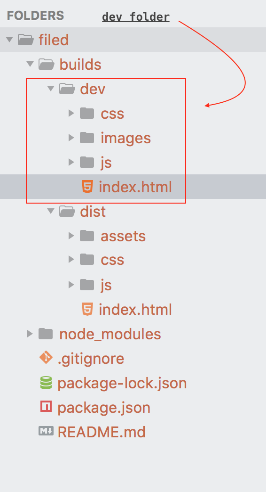
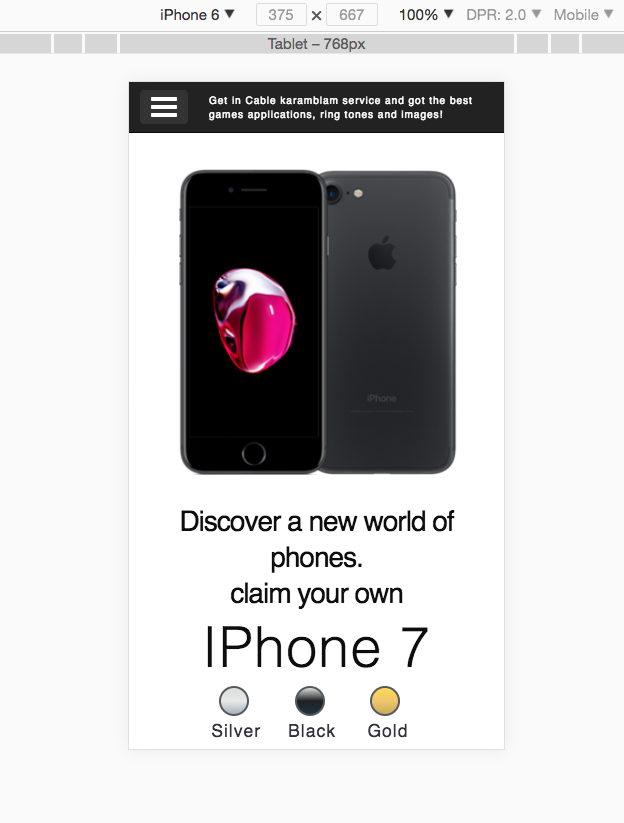

# how to

<kbd>tree :tree:</kbd>


<hr />

<kbd>landing-page</kbd>


<hr />

<kbd>iPad Pro</kbd>


<hr />

<kbd>iPad</kbd>


<hr />

<kbd>iPhone6 Plus</kbd>


<hr />

<kbd>iPhone6</kbd>


<hr />

<kbd>iPhone5</kbd>


<hr />


- ***first***: clone repository, type:

```
   git clone https://github.com/filed.git

```
- ***second***: install dependencies, type:

```
   npm install          // enter

```

> if it gets stuck, update npm or node.


- third & last: run server `npm start` in terminal


## or go to builds dev folder

- copy and paste: html, css, images, js folders to desktop

> npm scripts runs live server and watches/updates on changes.


